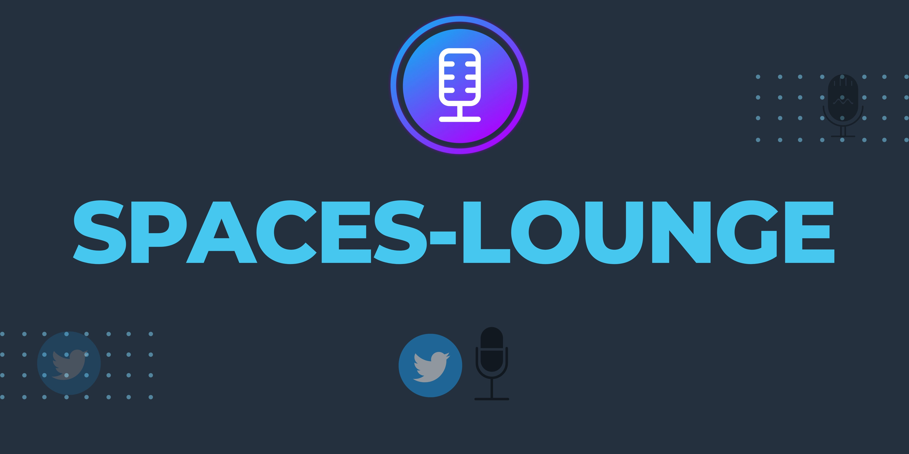

</img>

   
# What Is Spaces Lounge?

Imagine **The cool Spaces Lounge**, for twitter spaces. An exclusive place where you can find **The Upcoming Twitter Spaces**.

# Why Spaces Lounge?
1. Get a curated list of creators that you're interested in.
2. Find what interests you by easily filtering through tags and topics.
3. Get to speak on spaces with topics that interests you.
4. **For Hosts**- Find Speakers easily and grow your audience.

## Tech stack
Spaces Lounge is built using the following technologies:

- Frontend - **Next.js**
- CSS Framework - **Tailwind CSS**
- Design & Prototype - **Figma**

##Running the project

1. [Fork](https://github.com/avie-dev/spaceslounge/fork) the project.

2. Clone the repo:

   ```console
   $ git clone https://github.com/<your-github-username>/spaceslounge.git
   ```

3. Navigate to the cloned directory:

   ```console
   $ cd spaceslounge
   ```

4. Install dependencies:

   ```console
   $ yarn
   ```
   
   There is also [next-themes](https://www.npmjs.com/package/next-themes) being used and it might give error, in that case:
   
   ```console
   $ yarn add next-themes
   ```

5. Run the project

   ```console
   $ yarn dev
   ```
## 🛡️ License

Spaces Lounge is licensed under the MIT License - see the [LICENSE](LICENSE) file for details.


## 🧰 Contributing

- Any contributions you make are **truly appreciated**.
- To make a contribution to documentation, code or design please follow the [contributing guidelines](https://github.com/avie-dev/spaceslounge/blob/main/CONTRIBUTING.md)

## 🙏 Support

Don't forget to leave a star ⭐️